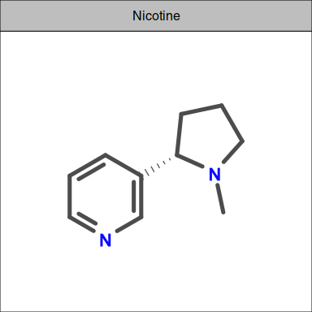
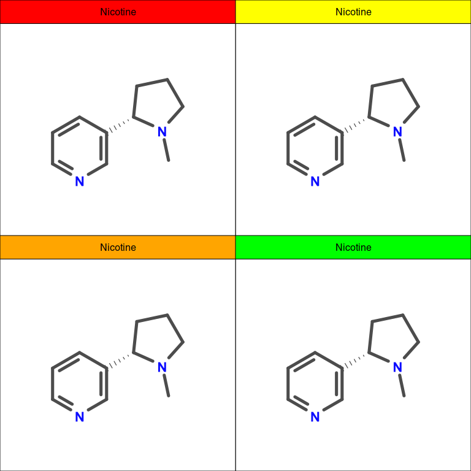

BabelR
================

This package provides some tools to ease the inclusion of chemical
structures into `Rmarkdown` documents.

It is distributed in the hopes it will be useful following the GNU GPL3+
license.

## Quick Start

``` r
remotes::install_github("wdkrnls/babelr")
```

``` r
library(babelr)
nic_sdf = file.path(system.file(package = "babelr"), 
                    "extdata", "nicotine.sdf")
out = ob_render(nic_sdf)
```

    ## '/tmp/RtmpDP1dFm/nicotine.svg' (SVG) was converted to '/tmp/RtmpDP1dFm/nicotine-grid.svg' (Cairo SVG)

``` r
nic = grImport2::readPicture(out$created)
nicgrob = grImport2::pictureGrob(nic)
fp = frame_picture(nicgrob, title = "Nicotine")

fp
```

<!-- -->

Multiple pictures can be plotted into a grid.

``` r
combine_frames(list(fp, fp, fp, fp), 
               background_fill = c("red", "orange", "yellow", "green"))
```

<!-- -->

It is also possible to override the layout.

``` r
combine_frames(list(fp, fp, fp, fp), 
               background_fill = c("red", "orange", "yellow", "green"),
               facet_layout = c(1, 4))
```

<!-- -->
